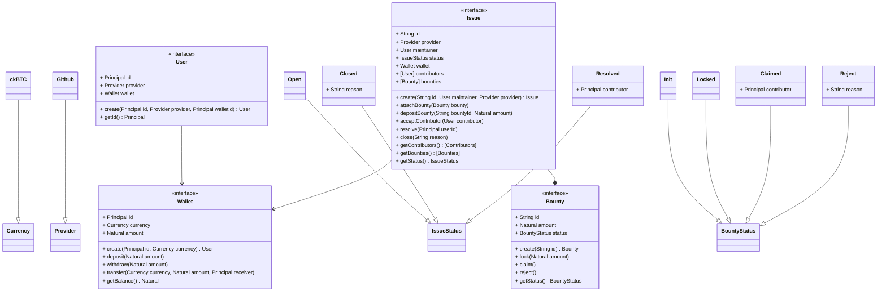

```mermaid
classDiagram
    class Currency
    class ckBTC
    ckBTC --|> Currency

    class Provider
    class Github
    Github --|> Provider

    class Wallet {
        <<interface>>
        + Principal id
        + Currency currency
        + Natural amount
        + create(Principal id, Currency currency) User
        + deposit(Natural amount)
        + withdraw(Natural amount)
        + transfer(Currency currency, Natural amount, Principal receiver)
        + getBalance() Natural
    }

    class User {
        <<interface>>
        %% icp address
        + Principal id
        + Provider provider
        + Wallet wallet
        + create(Principal id, Provider provider, Principal walletId) User
        + getId() Principal
    }
    User --> Wallet
    
    %% REVIEW
    class IssueStatus
    class Open
    class Closed {
        + String reason
    }
    class Resolved {
        + Principal contributor
    }
    Open --|> IssueStatus
    Closed --|> IssueStatus
    Resolved --|> IssueStatus

    class Issue {
        <<interface>>
        %% issue id
        + String id
        + Provider provider
        + User maintainer
        + IssueStatus status
        + Wallet wallet
        + [User] contributors
        + [Bounty] bounties
        + create(String id, User maintainer, Provider provider) Issue
        + attachBounty(Bounty bounty)
        + depositBounty(String bountyId, Natural amount)
        + acceptContributor(User contributor)
        + resolve(Principal userId)
        + close(String reason)
        + getContributors() [Contributors]
        + getBounties() [Bounties]
        + getStatus() IssueStatus

    }
    Issue --> Wallet
    Issue --* Bounty
    
    class BountyStatus
    %% created and waiting for deposit
    class Init
    %% deposit received
    class Locked
    %% claimed with success
    class Claimed {
        + Principal contributor
    }
    %% closed as unresolved
    class Reject {
        + String reason
    }
    Init --|> BountyStatus
    Locked --|> BountyStatus
    Claimed --|> BountyStatus
    Reject --|> BountyStatus

    class Bounty {
        <<interface>>
        + String id
        + Natural amount
        + BountyStatus status
        + create(String id) Bounty
        + lock(Natural amount)
        + claim()
        + reject()
        + getStatus() BountyStatus
    }

```