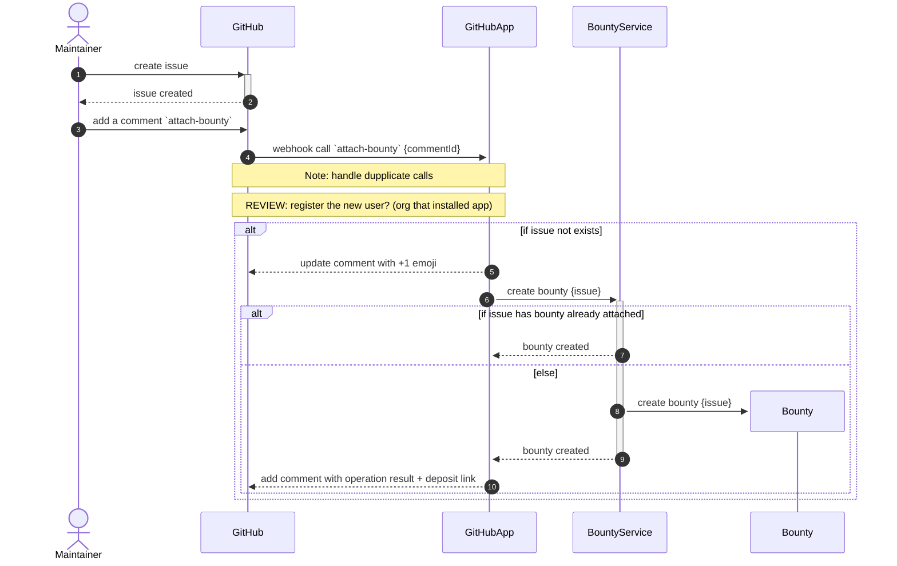

```mermaid
sequenceDiagram
    autonumber

    actor Maintainer
    participant GitHub
    participant GitHubApp
    participant BountyService

    Maintainer ->>+ GitHub: create issue
    GitHub -->>- Maintainer: issue created
    Maintainer ->> GitHub: add a comment `attach-bounty`
    GitHub ->>+ GitHubApp: webhook call `attach-bounty` {commentId}
    Note over GitHub,GitHubApp: Note: handle dupplicate calls
    Note over GitHub,GitHubApp: REVIEW: register the new user? (org that installed app)
    alt if issue not exists 
        GitHubApp -->> GitHub: update comment with +1 emoji
        GitHubApp ->>+ BountyService: create bounty {issue}
        alt if issue has bounty already attached
            BountyService -->> GitHubApp: bounty created
        else else
            create participant Bounty
            BountyService ->> Bounty: create bounty {issue}
            BountyService -->>- GitHubApp: bounty created
            GitHubApp -->> GitHub: add comment with operation result + deposit link
        end
    end
```
